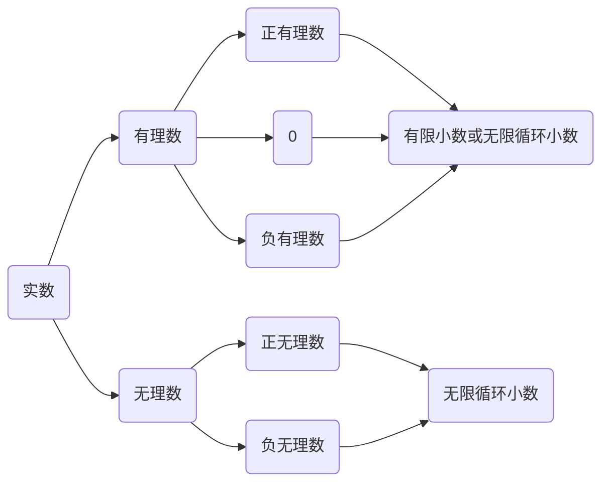
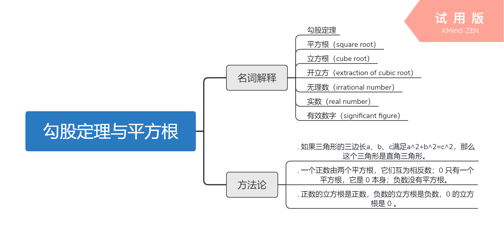

# 八年级上

> 2018-08-27 BoobooWei

[TOC]

# 轴对称图形

## 名词解释

### 轴对称（line symmetry）

### 对称轴（axis of symmetry）

### 对称点（symmetric points）

把一个图形沿着一条直线折叠，如果它能够与另一个图形重合，那么称这两个图形关于这条直线对称，也称这两个图形形成**轴对称（line symmetry）**，这条直线叫做**对称轴（axis of symmetry）**，两个图形中的对应点叫做**对称点（symmetric points）**。

### 轴对称图形（axially symmetric figure）

把一个图形沿着某一条直线折叠，如果直线两旁的部分能够互相重合，那么称这个图形是**轴对称图形（axially symmetric figure）**，这条直线就是对称轴。

### 垂直平分线（midpoint perpendicular）

垂直并且平分一条线段的直线，叫做这条线段的**垂直平分线（midpoint perpendicular）**。

### 等腰梯形（isosceles trapezoid）

梯形中，平行的一组对边称为底，不平行的一组对边称为腰，两腰相等的梯形叫做**等腰梯形（isosceles trapezoid）**

## 方法论

### 画轴对称图形

* 确定对称轴
* 找出对称点
* 连接对称点

### 轴对称图形

* 成轴对称的两个图形全等
* 如果两个图形成轴对称，那么对称轴是对称点连线的垂直平分线
* 成轴对称的两个图形的任何对应部分也成轴对称
* 轴对称图形中，两条成轴对称的线段的“走向”只有两种可能：互相平行或它们所在直线的交点在对称轴上

### 线段、角的轴对称性

* 线段是轴对称图形，线段的垂直平分线是它的对称轴
* 线段的垂直平分线上的点到线段两端的距离相等
* 到线段两端距离相等的点，在这条线段的垂直平分线上
* 线段的垂直平分线是到线段两端距离相等的点的集合
* 角的内部到角的两边距离相等的点，在这个角的平分线上

### 等腰三角形的轴对称性

* 等腰三角形是轴对称图形，顶角平分线所在直线是它的对称轴
* 等腰三角形的两个底角相等，（简称“等边对等角”）
* 等腰三角形的顶角平分线、底边上的中线、底边上的高互相重合
* 如果一个三角形有两个角相等，那么这两个角所对的边也相等，（简称“等角对边等”）
* 直角三角形斜边上的中线等于斜边的一半
* 等边三角形是轴对称图形，并且有三条对称轴
* 等边三角形的每个角都等于60°

### 等腰梯形的轴对称性

* 等腰梯形是轴对称图形，过两底重点的直线是它的对称轴
* 等腰梯形在同一底上的两个角相等
* 等腰梯形的对角线相等
* 在同一底上的两个角相等的梯形是等腰梯形

## 总结

# 勾股定理与平方根

## 名词解释

### 勾股定理

直角三角形两直角边的平分和等于斜边的平分。$a^2+b^2=c^2$

### 平方根（square root）

一般地，如果一个数的平分等于 $a$ ，那么这个数叫做 $a$ 的**平方根（square root）**，也成为二次方根，也就是说，如果 $x^2 = a$ ，那么 $x$ 就叫做 $a$ 的平方根。

### 立方根（cube root）

一般地，如果一个数地立方等于 $a$ ，那么这个数就叫做 $a$ 的**立方根（cube root）**，也称为三次方根，也就是说，如果 $x^3 = a$ ，那么 $x$ 叫做 $a$ 的立方根，数 $a$ 的立方根记作 $\sqrt[3]a$ ，读作“三次根号 $a$ ”。

### 开立方（extraction of cubic root）

求一个数的立方根的运算叫做**开立方（extraction of cubic root）**。

### 无理数（irrational number）

无限不循环小数成为**无理数（irrational number）**。

### 实数（real number）

有理数和无理数统称为**实数（real number）**。也就是说，实数可以分为有理数和无理数：

### 有效数字（significant figure）

对一个近似数，从左边第一个不是0的数字起，到末位数字止，所有的数字都称为这个近似数的**有效数字（significant figure）**。

## 方法论

* 如果三角形的三边长a、b、c满足$a^2+b^2=c^2$，那么这个三角形是直角三角形。
* 一个正数由两个平方根，它们互为相反数；$0$ 只有一个平方根，它是 $0$ 本身；负数没有平方根。$\pm\sqrt[2]5$
* 正数的立方根是正数，负数的立方根是负数，$0$ 的立方根是 $0$ 。

## 总结

# 中心对称图形

# 数量、位置的变化

# 一次函数

# 数据的集中程度