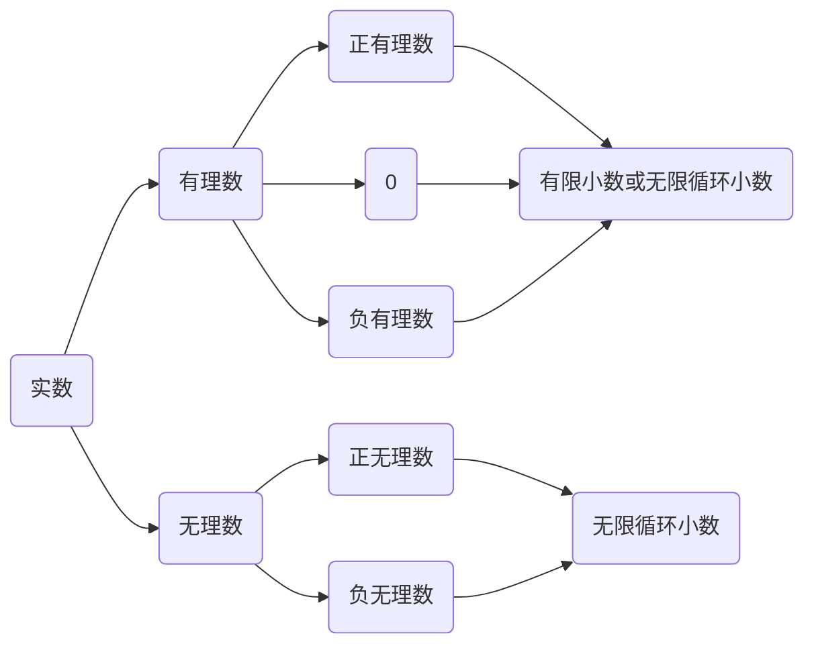

# 名词解释

## 勾股定理

直角三角形两直角边的平分和等于斜边的平分。$a^2+b^2=c^2$

## 平方根（square root）

一般地，如果一个数的平分等于 $a$ ，那么这个数叫做 $a$ 的**平方根（square root）**，也成为二次方根，也就是说，如果 $x^2 = a$ ，那么 $x$ 就叫做 $a$ 的平方根。

## 立方根（cube root）

一般地，如果一个数地立方等于 $a$ ，那么这个数就叫做 $a$ 的**立方根（cube root）**，也称为三次方根，也就是说，如果 $x^3 = a$ ，那么 $x$ 叫做 $a$ 的立方根，数 $a$ 的立方根记作 $\sqrt[3]a$ ，读作“三次根号 $a$ ”。

## 开立方（extraction of cubic root）

求一个数的立方根的运算叫做**开立方（extraction of cubic root）**。

## 无理数（irrational number）

无限不循环小数成为**无理数（irrational number）**。

## 实数（real number）

有理数和无理数统称为**实数（real number）**。也就是说，实数可以分为有理数和无理数：

## 有效数字（significant figure）

对一个近似数，从左边第一个不是0的数字起，到末位数字止，所有的数字都称为这个近似数的**有效数字（significant figure）**。

# 方法论

- 如果三角形的三边长a、b、c满足$a^2+b^2=c^2$，那么这个三角形是直角三角形。
- 一个正数由两个平方根，它们互为相反数；$0$ 只有一个平方根，它是 $0$ 本身；负数没有平方根。$\pm\sqrt[2]5$
- 正数的立方根是正数，负数的立方根是负数，$0$ 的立方根是 $0$ 。
